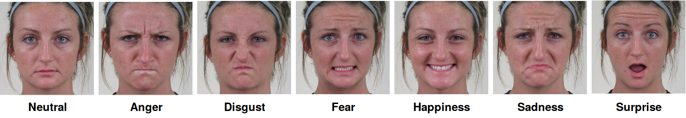
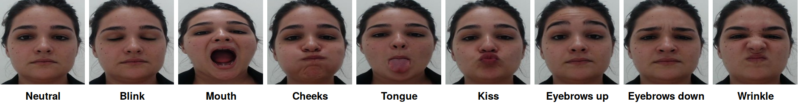

# DeepExpressions FER Models

## Emotions



## Gestures



## Citation

```bib
@inproceedings{Neto2019,
address = {Vitória, ES},
author = {Neto, Humberto da Silva and Fernandes, Mariana Rampinelli},
booktitle = {International Workshop on Assistive Technology},
keywords = {Facial Expression Recognition,Human Machine Interface},
pages = {197--200},
title = {{Facial Expression Recognition for Human Machine Interface Application}},
url = {http://iwatufes.com/ProceedingsIWAT2019.pdf},
year = {2019}
}
```

